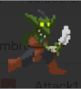

<h1 align="center"><b>H DEFENSE</b></h1>

<h2 align="center"><b> NineandoCorp</b></h2>

 

## Enlaces:
[Web del juego](https://pokoli0.github.io/PVLI-Taxistas/)

[Presentaciones](/Presentaciones/)

[UML]()

[QA]()

[GDD](#GDD)

## GDD
---
### Índice

### 1. Ficha técnica
- **Título**: H Defense
- **Género**: Tower Defense
- **Target**: Público joven con interés en juegos de estrategia
- **Rating**: +7
- **Plataforma**: PC
- **Modos de juego**: Campaña / Infinito

### 2. Descripción
"H Defense” es un videojuego de estrategia del género tower defense que te sumerge en un mundo fantástico que es asediado por hordas de diversas criaturas fantásticas y hostiles. Tu misión es defender la última fortaleza del Planeta H utilizando una variedad de torres defensivas y estrategias de diferente tipo.

### 3. Estética
El juego cuenta con una estética *Pixelart* no muy pronunciada. 
Asimismo, se cuenta con un estilo de fantasía, por tanto, habrá ciertas zonas con elementos oscuros y otras con elementos más llamativos. 
Además, puesto que el elemento principal del juego es la magia, esta se representa con el color morado.

La perspectiva del juego es isométrica. Sin embargo, algunos de los assets, principalmente enemigos y torres están en 2D, por tanto, se puede considerar un juego 2.5D. 

#### 3.1 Estética del escenario
El escenario está ambientado en un prado mágico  entre montañas. Así, el escenario cuenta con zonas donde predomina el color verde (prado) y zonas donde predomina el color gris (montaña). 

#### 3.2 Estética de enemigos
En los enemigos, en contraste al escenario, destacan colores más oscuros, con un aspecto más tenebroso.

#### 3.3 Estética de torres
Puesto que el juego está ambientado en  un mundo de fantasía, las torres cuentan con ciertos artefactos mágicos, y, por lo tanto, cada cual tiene los colores de los elementos que empleen. Por ejemplo, la torre Llama de Fénix cuenta, en su mayoría, con elementos de tono rojizo y naranja. 
Por otra parte, el resto de torres que no cuentan con un elemento en específico  contarán con diversos elementos con aspecto morado, puesto que es el color principal que representa a la magia.

#### 3.4 Estética de UI y menús
Al  igual que las torres, la estética de las distintas interfaces cuentan con el morado como color principal. 
No obstante, en contraste con la estética del escenario, estas interfaces van a tender a tonos más oscuros, puesto que así será más sencillo para el jugador reconocerlas durante la partida. 

### 4. Jugabilidad
En este apartado definiremos las mecánicas del juego, las cuales podemos dividir en 5 apartados principales: cámara, las mecánicas únicas del jugador y las mecánicas del escenario, enemigos y torres. Con todo esto englobamos las propiedades que harán jugable nuestro juego. 

#### 4.1 Cámara
La cámara se colocará en la parte superior de la pantalla y mostrará todos los puntos de spawn.
Asimismo, la cámara se puede desplazar en el eje x e y para explorar el mapa.

#### 4.2. Mecánicas del jugador
El jugador será capaz de realizar diferentes acciones, desde interactuar con el mapa hasta gestionar toda la partida (pausar, acelerar…). Dichas acciones se podrán manejar con el ratón, excepto algunas que tendrán atajos de teclado. A continuación, se explican más detalladamente:

##### 4.2.1 Interacción con el mapa
- Manteniendo el click izquierdo sobre el icono de la torre deseada en la barra inferior, arrastrar hasta la posición en la que se quiere colocar. Dicha torre no se puede mover una vez haya sido colocada.
- Las torres se podrán quitar sin recuperar ni perder dinero o cambiar de posición a cambio de dinero.
- Haciendo click sobre las torres colocadas, aparecerá un pop-up con información de la torre y tendremos la opción de mejorarla.
- Si has arrastrado una torreta y no la has colocado puedes cancelar la selección con click derecho.

##### 4.2.2 Gestión de la partida
- Pause: se podrá hacer click en un botón (parte superior derecha de la pantalla) o pulsar la tecla “ESCAPE” para pausar la partida. 
- Multiplicador de velocidad: se podrá hacer click en un botón en la parte superior derecha de la pantalla (>>) o pulsar la tecla “SPACE” para reproducir más rápido el transcurso de la partida (X2), si volvemos a darle al botón o presionar la tecla, la velocidad del transcurso del tiempo volverá a la normalidad (X1).
- Empezar: para empezar la ronda se podrá hacer click en dicho botón (parte inferior derecha de la pantalla) o pulsar la tecla “ENTER”.

#### 4.3 Mécanicas del escenario

El escenario está diseñado en 2D pero dando una sensación tridimensional con vista isométrica.

##### 4.3.1 Caminos
Para entender mejor el diseño del escenario es necesario diferenciar entre puntos de spawneo (lugares donde aparecen los enemigos) y destinos de los caminos. 

Los puntos de spawneo se encuentran en los límites del mapa. De cada spawn puede salir un grupo de enemigos con una ruta preestablecida de la cual saldrá por pantalla una sola vez justo antes de salir el primer enemigo. Los enemigos aparecerán de 1 en 1 hasta no haber más y con un intervalo que puede ser irregular. Esto da como resultado una sensación de progresión en la dificultad durante las rondas.

Asimismo, los caminos de cada grupo pueden cruzarse o ir por el mismo lado ya que los enemigos no se estorban entre ellos.

La evolución del escenario va en base a esta tabla: 

| NIVEL  | SPAWNS | DESTINOS |
|:---:|:---:|:---:|
| 1| 1 | 1 |
| 2| 2 | 2 |
| 3| 3 | 2 |
| 4| 5 | 2 |

##### 4.3.2 Zonas del escenario
Una de las mecánicas más características del escenario son las zonas del mismo, 	puesto que estas limitan el tipo de torre que se pueden situar sobre ellas.

Estas zonas son: 

| ZONAS | |
| :---: | :---:|
| Pradera | Suelen ser las zonas más próximas a los caminos. En ella solo se pueden situar torres de poco alcance o que necesiten situarse al lado del camino.|
|Montaña| Son zonas más alejadas de los caminos. En ella solo se pueden poner torres de gran alcance o torres que ataque a enemigos aéreos|
|Lagos|Estas zonas imposibilitan poner todo tipo de torres.|

### 4.4 Enemigos

Encima de cada enemigo se muestra su barra de vida.
Los enemigos se detendrán al encontrarse con una torre si es su objetivo, sin embargo los que tienen como objetivo el nexo no se detendrán.

Nos encontraremos con los siguientes tipos de enemigos:

| ENEMIGO | FOTO | Habilidades | Estadísticas |
| :---: | :---: | :---: | :---: |
| **Maestro de las Almas**|  | Habilidad especial:  Provoca ceguera a la torre que golpea (impide a la torre atacar durante un tiempo específico). | <ul><li>Tipo de tropa: Terrestre<li>Vida: 200<li>Daño: 10 <li>Tiempo de ataque: 1s<li> Tipo de ataque: cercano <li>Velocidad: 3<li>Objetivo: torres<ul/>
| **Acechante Eléctrico** |  | Habilidad especial: En un tiempo específico la tropa ejecuta una descarga que potencia la velocidad de los aliados cercanos(Se queda quieto para hacerlo y luego sigue corriendo). Si golpea el escudo del nexo lo inhabilita. | <ul><li>Tipo de tropa: Terrestre<li>Vida: 150<li>Daño: 20 <li>Tiempo de ataque: 1s<li> Tipo de ataque: cercano <li>Velocidad: 7<li>Objetivo: nexo<ul/>
| **Caballero Maldito**|   | Habilidad especial: Al morir genera 10 malditos. | <ul><li>Tipo de tropa: Terrestre<li>Vida: 2000<li>Daño: 150 <li>Tiempo de ataque: 3s<li> Tipo de ataque: cercano <li>Velocidad: 1<li>Objetivo: nexo<ul/>
| **Maldito** |  | Ninguna | <ul><li>Tipo de tropa: Terrestre<li>Vida: 100<li>Daño: 10 <li>Tiempo de ataque: 1s<li> Tipo de ataque: cercano <li>Velocidad: 3<li>Objetivo: torres<ul/>
| **Golem** |  | Habilidad especial: Regenera 10  de vida por segundo. | <ul><li>Tipo de tropa: Terrestre<li>Vida: 2500<li>Daño: 60 <li>Tiempo de ataque: 3s<li> Tipo de ataque: cercano <li>Velocidad: 2<li>Objetivo: nexo<ul/>
| **Demonio alado** |  | Ninguna | <ul><li>Tipo de tropa: Aérea<li>Vida: 25<li>Daño: 5 <li>Tiempo de ataque: 1s<li> Tipo de ataque: muy cercano <li>Velocidad: 4<li>Objetivo: torres<ul/>
| **Goblin** |  | Ninguna | <ul><li>Tipo de tropa: Terrestre<li>Vida: 40<li>Daño: 15 <li>Tiempo de ataque: 1s<li> Tipo de ataque: cercano <li>Velocidad: 6<li>Objetivo: nexo<ul/>
| **Esqueleto** |  | Ninguna | <ul><li>Tipo de tropa: Terrestre<li>Vida: 100<li>Daño: 10 <li>Tiempo de ataque: 2s<li> Tipo de ataque: cercano <li>Velocidad: 2<li>Objetivo: torres<ul/>
| **Mensajero de la Muerte** |  | Habilidad especial: Se desplaza en forma fantasmal siendo invisible a las torres, cuando llega a una torre aparece y la golpea. El muro y el nexo también lo hacen aparecer | <ul><li>Tipo de tropa: Terrestre<li>Vida: 100<li>Daño: 15 <li>Tiempo de ataque: 1s<li> Tipo de ataque: cercano <li>Velocidad: 3<li>Objetivo: torres<ul/>
| **Angel** |  | En un área alrededor de ella cura a sus aliados 1% de vida por segundo. No ataca, cuando llega al nexo se desvanece. | <ul><li>Tipo de tropa: Aérea<li>Vida: 400<li>Daño: 0 <li>Tiempo de ataque: <li> Tipo de ataque: cercano <li>Velocidad: 3<li>Objetivo: nexo<ul/>
| **Demonio Infernal**|  | Ninguna | <ul><li>Tipo de tropa: Aérea<li>Vida: 1500<li>Daño: 40 <li>Tiempo de ataque: 2s <li> Tipo de ataque: cercano <li>Velocidad: 3<li>Objetivo: nexo<ul/>
| **Defensor Real** |  | Habilidad especial: al morir invoca un campo de fuerza que se queda donde a muerto de forma que no se puede dañar a los enemigos en su interior durante 5 segundos | <ul><li>Tipo de tropa: Terrestre<li>Vida: 200<li>Daño: 10 <li>Tiempo de ataque: 1s <li> Tipo de ataque: cercano <li>Velocidad: 3<li>Objetivo: torres<ul/>

### 4.5 Torretas

Contamos con 2 tipos de torretas básicas (Torre de balas y Torre de arcilla terráquea), el resto se tendrán que comprar fuera del nivel para desbloquearlas, y 5 torretas adicionales con distintos efectos explicados a continuación. El alcance de las torretas es de 360º a menos que se especifique lo contrario en el apartado de la torreta correspondiente. Al colocar cada torreta empezará siendo de nivel 1, y se podrá mejorar con monedas en función de la cantidad de mejoras que se hayan desbloqueado en el menú principal. Es decir, si has desbloqueado 3 mejoras de ese tipo de torreta podrás mejorarla 3 veces durante la partida. Todas las torretas tendrán un máximo de 4 mejoras, pudiendo alcanzar un nivel máximo de 4. Cada torreta ocupará unos tiles del mapa, y no se podrán colocar torretas en los tiles ocupados.

Las torretas pueden estar en dos elevaciones diferentes:

- ALTA: Si una torreta está en elevación alta, no pueden recibir daño de los enemigos, ni aéreos ni terrestres.
- BAJA: Si una torreta está en elevación baja, pueden recibir daño de los enemigos que vengan por el camino.

Nos encontramos con los siguientes tipos de torretas:

- **Torre de Cristal de Energía**:
    - Mecánica especial: Genera un escudo protector alrededor del nexo cada 20 segundos, absorbiendo 200 puntos de vida. Si no se ha agotado el escudo y han pasado 20 segundos, se vuelve a restablecer a su valor máximo. Tan solo se puede colocar una torre de este tipo.
    - Mejoras Nivel 1 a 3: Aumenta en 50 puntos el escudo máximo.
    - Mejora Nivel 4: Aumenta en 50 puntos el escudo máximo, y agrega una explosión de energía al romperse que daña con 30 puntos a los enemigos cercanos.
    - Elevación: ALTA.
    - Puntos de vida: 50.

- **Torre de Slime Escape**:
    - Mecánica especial:  Dispara cada 5 segundos un slime en área que ralentiza a todas las tropas dentro del área que se mantiene en la zona del impacto durante 2 segundos. Dispara al enemigo más avanzado dentro de su rango de ataque. El efecto de ralentización dentro del área disminuye la velocidad de movimiento del enemigo en un 20%.
    - Mejora Nivel 1: Disminuye el intervalo del tiempo de disparo en 0,5 segundos.
    - Mejora Nivel 2: Aumenta el efecto de ralentización a un 30%.
    - Mejora Nivel 3: Aumenta el tiempo que se mantiene el slime en 0,5 segundos.
    - Mejora Nivel 4: Cualquier enemigo que se encuentre dentro del área recibirá un daño de 1 punto/segundo.
    - Elevación: BAJA.
    - Puntos de vida: 100.

- **Torre de balas**:
    - Mecánica especial:  Disparan balas cada 0,5 segundos al primer objetivo que entre en su rango, que hacen 5 puntos de daño al objetivo.
    - Mejora Nivel 1: Aumenta el daño a 10 puntos de daño por impacto.
    - Mejora Nivel 2: Aumenta el daño a 20 puntos de daño por impacto.
    - Mejora Nivel 3: Aumenta el daño a 35 puntos de daño por impacto.
    - Mejora Nivel 4:  Disparará al segundo enemigo más avanzado también.

- **Torre Diego Sniper**:
    - Mecánica especial:  Cada 3 segundos realizan un impacto unitario realizando un daño de 50 puntos al objetivo.Tiene un alcance superior al del resto de torres. Esta torre atacará primero al enemigo con más vida dentro del alcance.

    - Mejora Nivel 1: Realiza 75 de daño al objetivo por ataque.
    - Mejora Nivel 2: Probabilidad del 20% de realizar un impacto crítico que multiplica el daño en un 150%.
    - Mejora Nivel 3: Los tres segundos de espera para disparo se reducen a 2,5 segundos.
    - Mejora Nivel 4:  Los tres segundos de espera para disparo se reducen a 2 segundos, Probabilidad del 30% de realizar un impacto crítico.
    - Elevación: ALTA.
    - Puntos de vida: 50.

- **Torre de Llama de Fénix**:
    - Mecánica especial:  Realiza un daño en área (en forma de cono partiendo desde la torre aumentando el ángulo hacia delante) en el que realiza 2,5 puntos/medio segundo de daño. Cuando el arma ha estado disparando durante 5 segundos consecutivos se recalienta por lo que tiene un enfriamiento de 2 segundos en los que no puede disparar.

    - Mejora Nivel 1: Aumento del daño a 4 puntos/medio segundo. 
    - Mejora Nivel 2:  Se reducirá el enfriamiento a 1.5 segundos.
    - Mejora Nivel 3: Aumento del daño a 5 puntos/medio segundo y reducción del enfriamiento a 1 segundo.
    - Mejora Nivel 4:  Se permitirá al jugador elegir entre dos mejoras finales, tan solo podrá jugar una de ellas:
        - Aumento del ángulo del cono de ataque (+15 grados).
        - Reducción completa del enfriamiento (ataque continuo).
    - Elevación: ALTA.
    - Puntos de vida: 50.

- **Torre de Arcilla Terráquea**:
    - Mecánica especial:  Crea una barrera de tierra que bloquea el avance de los enemigos hasta  que es destruida.

    - Mejora Nivel 1:  La vida de la torre aumenta a 750 puntos. 
    - Mejora Nivel 2:  La vida de la torre aumenta a 1000 puntos.
    - Mejora Nivel 3: La vida de la torre aumenta a 1250 puntos.
    - Mejora Nivel 4:  La vida de la torre aumenta a 1500 puntos y refleja el daño por ataque que recibe devolviendo una cantidad de 3 puntos de ataque.
    - Elevación: BAJA.
    - Puntos de vida: 500.

- **Torre potenciadora**:
    - Mecánica especial:  En un área circular próxima a la torre aumenta en un 5% las estadísticas de las torretas cercanas (Aumento del daño).

    - Mejora Nivel 1:  Mejora el daño al 10%. 
    - Mejora Nivel 2:  Mejora la vida de las torretas cercanas en 30 puntos.
    - Mejora Nivel 3: Mejora el daño al 15%.
    - Mejora Nivel 4: Se permitirá al jugador elegir entre dos mejoras finales, tan solo podrá jugar una de ellas:
        - Mejora el daño al 20%.
        - Mejora la vida de las torretas cercanas en 50.

    - Elevación: ALTA/BAJA.
    - Puntos de vida: 75.

## Economía
En el juego existen dos tipos de moneda: las monedas doradas y las monedas plateadas (monedas H). 
- **Monedas doradas**: Las monedas doradas se consiguen durante cada partida, y solo sirven para la compra de torres  y para defender la base. El jugador comenzará cada partida con una cantidad fija de monedas doradas para comprar las torres iniciales, y al matar a un enemigo, éste otorga una cantidad de monedas según su tipo y según la ronda en la que esté el jugador. También el nexo irá generando monedas doradas cada cierto tiempo en función de su nivel.
- **Monedas H**: Las monedas H se utilizan para mejorar las estadísticas base de las torres entre partidas y comprar objetos, y se otorgan al final de cada partida en función de la actuación del jugador: la cantidad de enemigos que ha matado, el número de oleadas que ha aguantado y si ha pasado al siguiente nivel.

Por lo tanto, existen dos tiendas diferentes, una interna y una externa.

- **Tienda interna**: En el transcurso de cada partida el jugador debe ir comprando torretas y colocándolas en el mapa. En la parte inferior de la pantalla habrá una barra con los iconos de las distintas torres, y algunas estarán bloqueadas (con un filtro gris y sin el precio) y otras desbloqueadas (con color y mostrando el precio). El jugador irá desbloqueando las torretas para poder comprarlas en la tienda interna desde la tienda externa. Durante la partida también tendrá la opción de mejorar las torres.

- **Tienda externa**:En el menú principal, habrá una sección en la que estarán los iconos de todas las torres y se indicará si está desbloqueada y cuantas mejoras han sido desbloqueadas. Las bloqueadas mostrarán el precio de desbloqueo, y las desbloqueadas mostrarán las estadísticas base de las torres y la opción de desbloquear sus mejoras por un precio.

**Generación de monedas doradas**: Dependerá del nivel del nexo: 
- Nivel 1: 1/seg
- Nivel 2: 5/seg
- Nivel 3: 20/seg
- Nivel 4: 50/seg

## 6. Niveles
H Defense estará compuesto por 4 niveles distintos entre sí, con diferentes lugares, y con el único objetivo de defender la torre principal.

### 6.1. Oleadas

Las oleadas están formadas por varios grupos de enemigos. Cada grupo de enemigos tiene un punto de aparición, que debe estar en el borde del mapa, y cuando aparece un grupo se muestra su ruta durante aproximadamente 3 segundos (hay una animación del camino hacia el nexo). El grupo no aparece hasta que la ruta termina de ser dibujada. El jugador debe memorizar la ruta porque al dibujarse desaparecerá. Los enemigos avanzan por su ruta, y tienen un área de detección. Los enemigos atacarán a la primera torre que entre en su rango de detección.

Cada oleada termina cuando se eliminan a todos los grupos de enemigos. Al terminar cada oleada, se le dará al jugador 5 segundos para prepararse para la siguiente.

### 6.2 Diseño del nivel

Al comenzar el nivel el jugador puede comprar las primeras torretas con su dinero inicial, y las oleadas no comienzan hasta que el jugador pulsa el botón de empezar.

Durante el nivel podrás colocar las diferentes torres en sus respectivos lugares. Cuando escoges la torreta se aparecerá una cuadrícula para darte una idea de donde la puedes colocar, si dicha torreta no es compatible con el lugar no te dejará colocarla. Además, las torretas se podrán colocar durante la partida, a no ser que te hayas quedado sin dinero. 

Por los caminos aparecerán los diferentes enemigos aumentando la dificultad con el paso de los niveles, teniendo como destino la torre inicial. 

Para pasar de nivel, tendremos en cuenta las oleadas de enemigos que se van superando. En el nivel 1 el jugador deberá defenderse durante 10 oleadas. Al pasarlas, desbloqueará el nivel 2. En el nivel 2 habrá 20 oleadas, en el nivel 3, 30 oleadas y en el nivel 4, 40 oleadas. Al pasar cada nivel aparecerán enemigos más fuertes (sin mejorar stats) y con distintas habilidades.

### 6.3 Modo infinito

En este modo el jugador juega hasta que se destruye el nexo. Los enemigos mejoran en 2% el daño y la vida que en los niveles normales, de forma que sea más rentable jugar los niveles y se incentiven.

## 7. Dinámica

El jugador deberá desarrollar una estrategia defensiva a medida que los enemigos van apareciendo. Dado que los enemigos tienen un recorrido predefinido que el jugador no conoce, tendrá que averiguar cuales son las mejores posiciones para construir sus torretas. 

La progresión del juego irá acelerando a medida que el jugador va gastando sus recursos y derrotando a enemigos. La dificultad está definida por niveles y por las oleadas que hay en cada uno. 

El jugador tendrá que aprender los atributos de cada enemigo y torreta a su disposición. Además, cada mapa tiene un relieve y rutas diferentes con las que el jugador tendrá que adaptarse.

El objetivo del juego es pasarse todos los niveles, y para esto el jugador debe defenderse de todas las oleadas de enemigos de cada nivel. A medida que el juego avance el jugador irá aprendiendo las mecánicas de las torretas y de los enemigos. Averiguará qué torretas funcionan mejor con cada tipo de enemigo para defenderse de forma óptima.

## 8. Interfaces

- **Boceto del mapa principal**:
 

    - **Compra de torres**: Los iconos de las torres se encuentran en la parte inferior de la pantalla y se disponen una tras otra. Al mantener el cursor encima de una torre saldrá un pop-up con su información. Además, debajo del icono de las torres se encuentra el precio de estas. Solo aparecerán las desbloqueadas, y si hay huecos sobrantes aparecerán vacíos. Si hay demasiadas torres desbloqueadas para que quepan, el jugador podrá arrastrar la barra como un slider para ver todas.
    - **Indicador de monedas y oleada**: Estará en la parte superior izquierda de la pantalla, e indicará el número de monedas doradas que tiene el jugador y la oleada por la que está.
    - **Información del nexo**: Nivel y puntos de vida.
    - **Pop-up de información de torre**: Aparecerá al mantener el ratón por encima de una torre o un icono de torre de la barra inferior. Las que estén colocadas en el mapa mostrarán su nivel, sus puntos de vida en función de la vida máxima y su daño por ataque. Las de la barra inferior mostrarán su vida máxima, su daño por ataque y una breve descripción de sus mecánicas.
    - **Pausa y mayor velocidad**: En la parte superior derecha se hallan 2 iconos, uno que te llevará al menú de pausa y otro que sirve para hacer que la partida vaya más rápido, haciendo que todo el juego se acelere en un 100%.
    - **Botón para empezar**: abajo a la derecha está el botón de comenzar la siguiente oleada, teniendo así un tiempo entre oleada y oleada para poner más torres en el campo de juego.

- **Menú externo**:
 
    - **Parte izquierda**: Nivel del nexo, puntos de vida máximos y botón de mejora del nexo con el precio. Las mejoras del nexo hacen que el jugador tenga más monedas doradas de base al empezar la partida, que se generen más monedas doradas cada cierto tiempo y que el nexo tenga más vida. Hay un máximo de 4 niveles, y en cada nivel cuesta más mejorarlo (posiblemente exponencial).
    - **Parte Central**: Indicador de cantidad de monedas H, oleada máxima alcanzada por el jugador y libro de enemigos en la parte superior, y en la parte inferior se encuentra el botón para empezar la partida.
    - **Libro de Enemigos**:  
    - **Parte derecha**: Información sobre las torretas, si están bloqueadas o desbloqueadas, precio por desbloquearlas si están bloqueadas y precio por mejorarlas si están desbloqueadas. Información de sus estadísticas y habilidades.
    - **Botón de empezar**: Te lleva a la selección de niveles, una sección parecida al libro de enemigos donde aparecerán tanto los bloqueados como los desbloqueados. Al clicar el nivel deseado, aparecerá el mapa del nivel y empezará.
- **Menú de pausa**:
El HUD del menú de pausa presenta 3 botones que sirven para volver al juego, entrar en el menú de opciones y para salir del juego.
 

- **Flujo de juego**:
  

Al morir o pasar de nivel aparece una ventana que muestra la ronda a la que se ha llegado y las monedas H obtenidas. Con un botón de continuar, te lleva al menú externo.

## 9. Guardado

El juego guarda automáticamente el estado externo de la partida. Es decir, la cantidad de monedas H que tiene el jugador, el nivel de las torres, el nivel del nexo, la cantidad de enemigos que el jugador ha visto y la oleada máxima alcanzada.

## 10. Contenido

En el vasto mundo mágico de Eldoria, el Planeta H se encuentra en el epicentro de un conflicto ancestral entre las fuerzas de la luz y la oscuridad. En este reino de magia y maravillas, existe una torre imponente conocida como la Torre de Eternia, la cual sirve como el último bastión de defensa contra las fuerzas malignas que amenazan con sumir al Planeta H en la oscuridad eterna.

La Torre de Eternia fue erigida hace milenios por los sabios magos y guerreros más poderosos de Eldoria, fusionando la magia ancestral con la tecnología más avanzada. Esta torre, construida en lo más alto de una montaña sagrada, emana una barrera mágica que protege todo el Planeta H. Sin embargo, la profecía predice que en algún momento las fuerzas oscuras se alzarán y tratarán de derribar esta última línea de defensa.

En respuesta a la inminente amenaza de las fuerzas oscuras, el Consejo de la Luz convoca a los héroes para que lideren la construcción de una red de torres mágicas defensivas alrededor de la Torre de Eternia. Estas torres, conocidas como Torres de Vigilia, se convertirán en la clave para repeler la invasión enemiga y proteger la barrera mágica que resguarda al Planeta H.

## 11. Presentaciones
- Hito 0: https://www.canva.com/design/DAF77q2_lN4/kAq_e8tkWTQHgje6bMVrdA/edit?utm_content=DAF77q2_lN4&utm_campaign=designshare&utm_medium=link2&utm_source=sharebutton

## 12. Referencias

- Rogue tower (Género: Casual, Estrategia;  28/1/2022)
- BTD5 (Género: Tower Defense, Casual, Estrategia; 19/11/2014)
- Plants vs Zombies (Género: Casual, Estrategia; 5/5/2009)